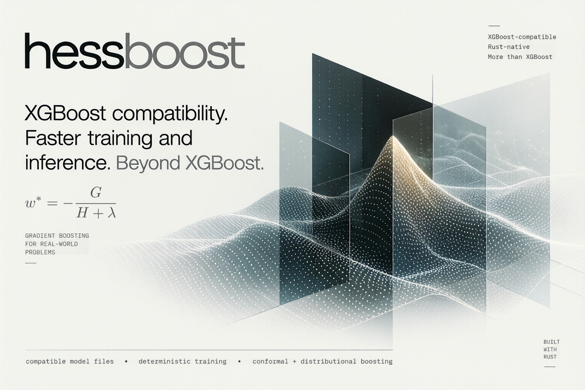

# hessboost

[](https://crates.io/crates/hessboost)
[](https://docs.rs/hessboost)
[](https://github.com/brndnmtthws/hessboost/actions/workflows/ci.yml)
[](LICENSE)



**XGBoost gradient boosting in Rust, trained faster.** hessboost takes
XGBoost's parameters, reproduces XGBoost 3.4.2's predictions (checked
against XGBoost in CI), and reads and writes XGBoost model files. On an Apple
M3 Max it trains 2.3–2.8× faster than XGBoost on one thread and 1.4–1.6×
faster on 16, with the same held-out scores. The only native dependency is
libzstd.

The name comes from the Hessian: like XGBoost, hessboost fits each tree to
the loss's second derivatives as well as its gradients (Newton boosting).
Without an L1 penalty (`alpha`) or a `max_delta_step` clamp, a leaf's weight
is `w* = −G / (H + λ)`, where `G` and `H` sum its rows' gradients and
Hessians and `λ` is the L2 penalty `lambda`.

## Why hessboost

- **XGBoost-compatible.** Same parameter, objective, and metric names.
  Deterministic configurations reproduce XGBoost's predictions, and models
  move both ways through XGBoost JSON and UBJSON: train in one, serve in the
  other.
- **Fast.** Multi-core training with runtime-detected NEON and AVX2 kernels;
  see [`docs/performance.md`](docs/performance.md).
- **Strict.** An unsupported setting or combination is an error, never
  silently ignored.
- **Deterministic.** The same parameters, data, and seed give the same model
  on any thread count.
- **Stable model files.** Models saved by 0.2.0 or later load in every later
  release.
- **More than XGBoost, opt-in.** Conformal intervals, distributional
  boosting, budget training, compact models, and more. All are off by
  default and leave default training unchanged.

## Getting started

```sh
cargo add hessboost
```

Needs Rust 1.93 or newer and a C compiler (to build libzstd).

```rust
use hessboost::prelude::*;

fn main() -> Result<()> {
    // 100 rows × 4 features, row-major, and one label per row.
    let (n_rows, n_cols) = (100, 4);
    let x: Vec<f32> = (0..n_rows * n_cols).map(|i| (i % 17) as f32 / 17.0).collect();
    let y: Vec<f32> = x.chunks(n_cols).map(|row| 2.0 * row[0] - row[1]).collect();

    let dtrain = DMatrix::from_dense(&x, n_rows, n_cols)?.with_labels(&y)?;

    let params = TrainingParams::builder()
        .objective("reg:squarederror")
        .tree_method(TreeMethod::Hist)
        .max_depth(6)
        .eta(0.1)
        .subsample(0.9)
        .build()?;

    let model = train(&params, &dtrain, 200)?;
    let preds = model.predict(&dtrain)?;
    println!("first prediction: {}", preds[0]);

    model.save_binary("model.bin")?;
    let reloaded = BoostedModel::load_binary("model.bin")?;
    assert_eq!(reloaded.predict(&dtrain)?, preds);
    Ok(())
}
```

For eval sets, early stopping, custom objectives, or continued training,
use `Trainer` (the equivalent of `xgb.train`'s keyword arguments):

```rust
let result = Trainer::new(&params, &dtrain, 1000)
    .eval(&dvalid, "valid")
    .early_stopping_rounds(20)
    .train()?;
let model = result.model; // predicts with the best iteration
```

The [API documentation](https://docs.rs/hessboost) covers every type and
option, and [`examples/`](examples) has runnable programs
(`cargo run --release --example <name>`):

| Example | Shows |
|---|---|
| `train_regression` | end-to-end regression with feature importance |
| `binary_classification` | a watched eval set, early stopping, AUC |
| `multiclass` | per-class probabilities and predicted classes |
| `ranking` | LambdaMART over query groups |
| `constraints` | monotone and interaction constraints, categorical features |
| `custom_objective` | a custom loss and eval metric |
| `shap` | SHAP contributions and interaction values |
| `model_io` | native and XGBoost JSON/UBJSON save and load |
| `conformal` | calibrated prediction intervals |
| `distributional` | predictive distributions, intervals, and NLL |
| `ordered_target_stats` | encoding a high-cardinality categorical |
| `compact_model` | reuse penalties and the compact model format |
| `budget` | budget training against default and tuned training |
| `pfn_boost` | boosting from a pretrained model's logits |
| `metal` | CPU vs GPU prediction (macOS, `--features metal`) |

## What's included

From XGBoost:

- The `gbtree`, `dart`, and `gblinear` boosters, and boosted random forests.
- The `exact`, `hist`, and `approx` tree methods, with missing values,
  native categorical splits, row and column sampling, and monotone and
  interaction constraints.
- XGBoost's CPU objectives: regression (including quantile and expectile),
  binary and multiclass classification, counts, ranking (LambdaMART), and
  survival (Cox, AFT). Nearly all of its eval metrics, plus custom
  objectives and metrics.
- Multi-output models: multi-target label matrices and vector-leaf trees.
- Cross-validation (shuffled, custom, or time-ordered folds), continued
  training, tree refresh, model slicing, and iteration ranges.
- Margins, classes, leaf indices, SHAP contributions and interactions, and
  feature importance.
- Dense and sparse input, libsvm and CSV loaders, and native binary and JSON
  model files.

Beyond XGBoost (opt-in):

| Feature | What it gives you |
|---|---|
| [Conformal intervals](https://docs.rs/hessboost/latest/hessboost/conformal/) | prediction intervals with a finite-sample coverage guarantee |
| [Distributional boosting](https://docs.rs/hessboost/latest/hessboost/objective/distributional/) | a full predictive distribution per row (`dist:normal`, `dist:gamma`, ...), after NGBoost and XGBoostLSS |
| [Budget training](https://docs.rs/hessboost/latest/hessboost/training/budget/) | one `budget` number instead of tuning learning rate, depth, and rounds, after PerpetualBooster |
| [Compact models](https://docs.rs/hessboost/latest/hessboost/model/compact/) | a bit-packed format with bit-identical margins, 2.8–3.3× smaller than the native binary in the `compact_model` example |
| LightGBM and CatBoost tree options | `extra_trees`, `path_smooth`, linear leaves (`linear_tree`), and symmetric trees |
| Quantized-gradient training | up to 1.85× faster tree building on large data (`use_quantized_grad`) |
| [Ordered target statistics](https://docs.rs/hessboost/latest/hessboost/data/target_stats/) | CatBoost-style ordered target encoding of high-cardinality categoricals |
| Boosting from a pretrained model | start from TabPFN or LLM logits through `base_margin` (PFN-Boost, LLM-Boost) |
| Metal GPU (macOS, `--features metal`) | GPU prediction about 2.5× faster than the CPU on an M4 Max, and GPU training that reproduces CPU training bit for bit |

## Caveats

- Training that draws random numbers (row or column sampling, forests, DART)
  matches XGBoost in model quality, not tree for tree: the random streams
  differ.
- gblinear, custom-objective, `dist:*`, and linear-leaf models have no
  XGBoost encoding; they save in the native formats only.
- Native model files from 0.1.x are refused.
- GPU training exists for exactness, not speed yet: it has not been
  measured to beat multicore CPU training. The Metal backend needs macOS
  10.15 or later and a GPU with 64-bit integer support (every Apple Silicon
  Mac).
- Budget training is slow: 10–54× the time of a depth-6 `hist` fit with the
  same number of trees.
- Quantized gradients pay off only when histogram building dominates; on
  50,000 rows they are roughly break-even.

## Not implemented

- Distributed and external-memory training.
- Python, CLI, and C bindings.
- GPU training outside macOS (a `wgpu` backend is planned).
- A few XGBoost options exist at one setting only, and a few metrics are
  missing; the [API docs](https://docs.rs/hessboost/latest/hessboost/#not-implemented)
  list them.

## Contributing

[`AGENTS.md`](AGENTS.md) has the build, lint, and test commands and the
project's invariants; [`scripts/README.md`](scripts/README.md) covers the
XGBoost parity suite and benchmark harnesses.

## License and attribution

Licensed under the [Apache License, Version 2.0](LICENSE). Copyright 2026
Brenden Matthews.

hessboost is a fork of
[sequoia-boost](https://github.com/pgarrett-scripps/sequoia-boost)
(Copyright 2026 Patrick Garrett, Apache-2.0).

hessboost is not affiliated with or endorsed by the
[XGBoost](https://github.com/dmlc/xgboost) project, and contains no XGBoost
source code.

Budget training reimplements
[PerpetualBooster](https://github.com/perpetual-ml/perpetual)'s algorithm
(Copyright 2024 Perpetual ML, Apache-2.0); no Perpetual code is copied.

The error function used by the AFT normal distribution is ported from
glibc 2.41's `s_erf.c`, derived from Sun Microsystems' fdlibm (Copyright (C)
1993 Sun Microsystems, Inc.); `src/objective/survival.rs` carries its notice.
