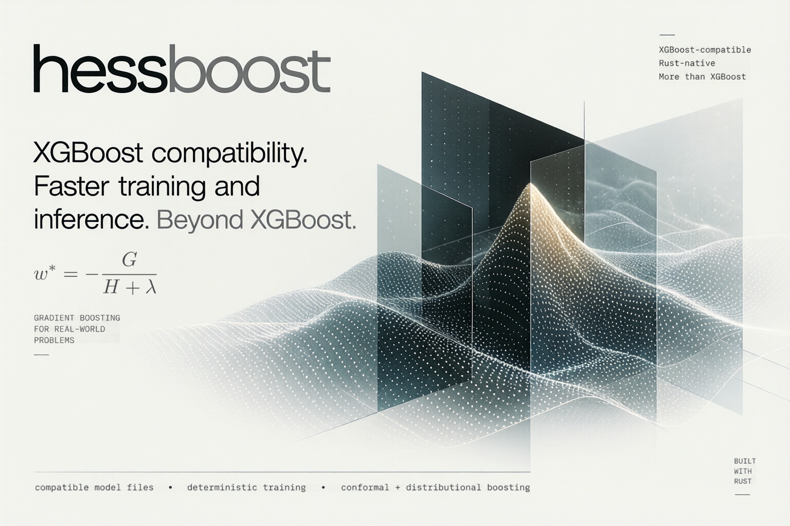

# hessboost

[](https://crates.io/crates/hessboost)
[](https://docs.rs/hessboost)
[](https://github.com/brndnmtthws/hessboost/actions/workflows/ci.yml)
[](LICENSE)



**XGBoost-compatible gradient boosting in Rust, trained faster.** hessboost
takes XGBoost's parameters, matches XGBoost 3.4.2's predictions (checked
against XGBoost in CI), and reads and writes XGBoost model files. On an Apple
M3 Max it trains 2.6–3.0× faster single-threaded and 1.8–2.0× faster on 16
threads (5.0× on multiclass), with identical held-out scores. The only native
dependency is libzstd.

The name comes from the Hessian: like XGBoost, hessboost fits each tree to
the loss's gradients and second derivatives (Newton boosting). Without an L1
penalty (`alpha`) or a `max_delta_step` clamp, a leaf's weight is
`w* = −G / (H + λ)`, where `G` and `H` sum its rows' gradients and Hessians
and `λ` is the L2 penalty `lambda`.

## Why hessboost

- **XGBoost-compatible.** Same parameter, objective, and metric names.
  Deterministic configs reproduce XGBoost's predictions, and models move both
  ways via XGBoost JSON and UBJSON: train in one, serve in the other.
- **Fast.** Multi-core training with runtime-detected NEON and AVX2 kernels;
  see [`docs/performance.md`](docs/performance.md).
- **Strict.** Unsupported settings are an error, never silently ignored.
- **Deterministic.** Same parameters, data, and seed give the same model on
  any thread count.
- **Stable model files.** Anything saved by 0.2.0 or later loads in every
  later release.
- **More than XGBoost, opt-in.** Conformal intervals, confidence intervals
  for the regression function (Boulevard boosting), explainable boosting
  machines with shape-function bands, distributional boosting, SGLB
  uncertainty, budget training, compact models, XE-NDCG ranking, and more —
  all off by default, none of them changes default training.

## Getting started

```sh
cargo add hessboost
```
For users pinning a release series in a Cargo manifest:

```toml
hessboost = "0.2"
```

Needs Rust 1.93 or newer and a C compiler (to build libzstd).

```rust
use hessboost::prelude::*;

fn main() -> Result<()> {
    // 100 rows × 4 features, row-major, and one label per row.
    let (n_rows, n_cols) = (100, 4);
    let x: Vec<f32> = (0..n_rows * n_cols).map(|i| (i % 17) as f32 / 17.0).collect();
    let y: Vec<f32> = x.chunks(n_cols).map(|row| 2.0 * row[0] - row[1]).collect();

    let dtrain = DMatrix::from_dense(&x, n_rows, n_cols)?.with_labels(&y)?;

    let params = TrainingParams::builder()
        .objective(Objective::SquaredError)
        .tree_method(TreeMethod::Hist)
        .max_depth(6)
        .eta(0.1)
        .subsample(0.9)
        .build()?;

    let model = train(&params, &dtrain, 200)?;
    let preds = model.predict(&dtrain)?;
    println!("first prediction: {}", preds.get(0, 0).unwrap());

    model.save_binary("model.bin")?;
    let reloaded = BoostedModel::load_binary("model.bin")?;
    assert_eq!(reloaded.predict(&dtrain)?, preds);
    Ok(())
}
```

For eval sets, early stopping, custom objectives, or continued training, use
`Trainer` (the `xgb.train` keyword-argument equivalent):

```rust
let result = Trainer::new(&params, &dtrain, 1000)
    .eval(&dvalid, "valid")
    .early_stopping_rounds(20)
    .train()?;
let model = result.model; // predicts with the best iteration
```

Every type and option is in the [API docs](https://docs.rs/hessboost);
runnable programs live in [`examples/`](examples)
(`cargo run --release --example <name>`):

| Example | Shows |
|---|---|
| `train_regression` | end-to-end regression with feature importance |
| `binary_classification` | a watched eval set, early stopping, AUC |
| `balanced_bagging` | LightGBM class-stratified sampling for imbalanced binary classification |
| `multiclass` | per-class probabilities and predicted classes |
| `ranking` / `rank_xendcg` | LambdaMART and XE-NDCG with query bagging |
| `constraints` | monotone and interaction constraints, categorical features |
| `custom_objective` | a custom loss and eval metric |
| `shap` | SHAP contributions and interaction values |
| `model_io` | native and XGBoost JSON/UBJSON save and load |
| `conformal` | calibrated prediction intervals |
| `boulevard_inference` | confidence intervals for `f(x)` and prediction intervals |
| `ebm` | an explainable boosting machine's shape functions and their confidence bands |
| `distributional` | predictive distributions, intervals, and NLL |
| `virtual_ensembles` | SGLB posterior sampling: knowledge uncertainty rising off the training data |
| `ordered_target_stats` | encoding a high-cardinality categorical |
| `compact_model` | reuse penalties and the compact model format |
| `budget` | budget training against default and tuned training |
| `online_update` | adding and deleting training rows in place, and exact unlearning |
| `pfn_boost` | boosting from a pretrained model's logits |
| `metal` | CPU vs GPU prediction (macOS, `--features metal`) |

## Python

[`python/`](python) holds the Python package (`pip install hessboost`),
with XGBoost's Python API (`DMatrix`, `train`, `cv`, `Booster`),
scikit-learn estimators, pandas categorical input, and the conformal,
distributional, and in-place update extras:

```python
import hessboost

booster = hessboost.train(
    {"objective": "binary:logistic", "max_depth": 4}, hessboost.DMatrix(X, label=y), 100
)
probabilities = booster.predict(X_test)
```

See [`python/README.md`](python/README.md).

## What's included

From XGBoost:

- `gbtree`, `dart`, and `gblinear` boosters, plus boosted random forests.
- The `exact`, `hist`, and `approx` tree methods, with missing values,
  native categorical splits, row and column sampling, and monotone and
  interaction constraints.
- XGBoost's CPU objectives — regression (incl. quantile and expectile),
  binary/multiclass classification, counts, LambdaMART ranking, Cox/AFT
  survival — and nearly all its metrics, plus custom objectives and metrics.
  Objectives and metrics are typed (`Objective::Tweedie(Tweedie::new(1.3)?)`,
  `EvalMetric::Ndcg(Cutoff::top(5)?)`), and
  `TrainingParams::from_xgboost` reads an XGBoost `params` dict.
- Multi-output models: multi-target label matrices and vector-leaf trees.
- Cross-validation (shuffled, custom, time-ordered, or purged by each row's
  label window), continued training, tree refresh, a per-round hook
  (progress, custom stopping, cancellation), model slicing, iteration
  ranges.
- Margins, classes, leaf indices, SHAP values and interactions, feature
  importance.
- Dense and sparse input, libsvm/CSV loaders, native binary and JSON models.

Beyond XGBoost (opt-in, none changes default training):

| Feature | What it gives you |
|---|---|
| [Conformal intervals](https://docs.rs/hessboost/latest/hessboost/conformal/) | prediction intervals with a finite-sample coverage guarantee |
| [Boulevard inference](https://docs.rs/hessboost/latest/hessboost/inference/) | Boulevard boosting (`booster = boulevard`, with BRAT-D dropout and BRAT-P parallel variants) and its asymptotic confidence intervals for `f(x)` and prediction intervals, after Zhou & Hooker (JMLR 2022) and Fang, Tan & Hooker (NeurIPS 2025); squared error only |
| [Explainable boosting machines](https://docs.rs/hessboost/latest/hessboost/ebm/) | GA²M models (`booster = ebm`): cyclic per-feature trees, outer bags with per-bag early stopping, FAST pair terms (Lou et al., KDD 2013; InterpretML), numerical and categorical terms, per-term shape functions, and with `ebm_boulevard` confidence bands on every shape (Fang, Tan, Pipping & Hooker, AISTATS 2026) |
| [Distributional boosting](https://docs.rs/hessboost/latest/hessboost/objective/distributional/) | a full predictive distribution per row (`dist:normal`, `dist:gamma`, ...), after NGBoost and XGBoostLSS |
| [SGLB and virtual ensembles](https://docs.rs/hessboost/latest/hessboost/model/uncertainty/) | CatBoost's Langevin boosting, model shrinkage, and `posterior_sampling`; knowledge, data, and total uncertainty from one model's truncations (after Malinin et al., ICLR 2021) |
| [Budget training](https://docs.rs/hessboost/latest/hessboost/training/budget/) | one `budget` number instead of tuning learning rate, depth, and rounds, after PerpetualBooster |
| [In-place updates](https://docs.rs/hessboost/latest/hessboost/training/online/) | add or delete training rows of a trained model (incremental learning, machine unlearning): exact, or approximate and faster than retraining for small changes, after Lin et al. |
| [Compact models](https://docs.rs/hessboost/latest/hessboost/model/compact/) | a bit-packed format with bit-identical margins, 2.8–3.3× smaller than the native binary in the `compact_model` example |
| [LightGBM model import](https://docs.rs/hessboost/latest/hessboost/model/#lightgbm-import) | load LightGBM 4.x text models (`model.txt`) that predict, explain with SHAP, slice, and save like native ones, checked against LightGBM's predictions and `pred_contrib`; splits or objectives with no exact equivalent are refused |
| LightGBM and CatBoost options | `extra_trees`, `path_smooth`, linear leaves (`linear_tree`), symmetric trees, class-balanced bagging for binary classification (`pos_bagging_fraction`, `neg_bagging_fraction`; replaces `subsample`), query-level ranking bagging (`bagging_by_query`), and XE-NDCG ranking (`rank:xendcg`) |
| Quantized-gradient training | up to 1.85× faster tree building on large data (`use_quantized_grad`) |
| [Ordered target statistics](https://docs.rs/hessboost/latest/hessboost/data/target_stats/) | CatBoost-style ordered target encoding of high-cardinality categoricals |
| Boosting from a pretrained model | start from TabPFN or LLM logits through `base_margin` (PFN-Boost, LLM-Boost) |
| Metal GPU (macOS, `--features metal`) | GPU prediction about 2.5× faster than the CPU on an M4 Max, and GPU training that reproduces CPU training bit for bit |
## Caveats

- Approximate in-place updates (`training::online`,
  `OnlineParams::approximate`) stay close to retraining without matching it,
  and pay off for small changes (1.3–4.8x faster than retraining for 0.1–1%
  of the rows in its benchmarks; slower beyond a few percent). They keep the
  training bins, so they refuse added values beyond the training range.
  Unlearning is exact only in the exact mode (`OnlineParams::exact`; Python
  `tolerance=0`), which costs a retrain.
- Randomized training (sampling, forests, DART) matches XGBoost's quality,
  not its trees: the random streams differ.
- `rank:xendcg` uses stateless keyed SplitMix64 draws per seed, iteration,
  query, and document, so its random values and trained trees differ from
  LightGBM's `rank_xendcg` RNG.
- gblinear, custom-objective, `dist:*`, and linear-leaf models have no
  XGBoost encoding — native formats only.
- 0.1.x native model files are refused.
- GPU training is exact, not fast yet: unmeasured against multicore CPU.
  Metal needs macOS 10.15+ and a 64-bit-integer GPU (all Apple Silicon).
- Budget training runs 10–54× a depth-6 `hist` fit with the same tree count.
- Quantized gradients only pay off when histogram building dominates; on
  50,000 rows they're break-even.
- SGLB needs `gbtree` with one tree per output and iteration; model
  shrinkage refuses DART, continued training, and per-row `base_margin`s,
  a shrunk model's iteration ranges must start at 0, and its XGBoost export
  matches its predictions within `f32` rounding (not bit for bit).
- Boulevard's intervals for `f(x)` are asymptotic and ignore the fit's
  bias: they reach nominal coverage when the leaves are refitted on an
  independent sample (`honest_refit`) and the bias is small, and
  under-cover otherwise: 95% intervals cover 0.73 of the time in the
  paper's 3-d test setup and 0.15 in 5 dimensions (validated table in the
  `inference` docs). Its prediction intervals assume Gaussian noise.
- A Boulevard EBM's shape-function bands (`ebm_boulevard`) share those
  caveats: they are conditional on the trees, so 95% bands covered
  0.76–0.86 of the time with `honest_refit` and 0.57–0.71 in-sample in the
  simulations of the `EbmInference` docs.

## Not implemented

- Distributed and external-memory training.
- CLI and C bindings.
- GPU training outside macOS (a `wgpu` backend is planned).
- A few XGBoost options exist at one setting only, and a few metrics are
  missing; the [API docs](https://docs.rs/hessboost/latest/hessboost/#not-implemented)
  list them.

## Contributing

[`AGENTS.md`](AGENTS.md) has the build, lint, and test commands and the
project's invariants; [`scripts/README.md`](scripts/README.md) covers the
XGBoost parity suite and benchmark harnesses.

## License and attribution

Licensed under the [Apache License, Version 2.0](LICENSE). Copyright 2026
Brenden Matthews.

hessboost is a fork of
[sequoia-boost](https://github.com/pgarrett-scripps/sequoia-boost)
(Copyright 2026 Patrick Garrett, Apache-2.0).

hessboost is not affiliated with or endorsed by the
[XGBoost](https://github.com/dmlc/xgboost) project, and contains no XGBoost
source code.

Budget training reimplements
[PerpetualBooster](https://github.com/perpetual-ml/perpetual)'s algorithm
(Copyright 2024 Perpetual ML, Apache-2.0); no Perpetual code is copied.

The error function used by the AFT normal distribution is ported from
glibc 2.41's `s_erf.c`, derived from Sun Microsystems' fdlibm (Copyright (C)
1993 Sun Microsystems, Inc.); `src/objective/survival.rs` carries its notice.
