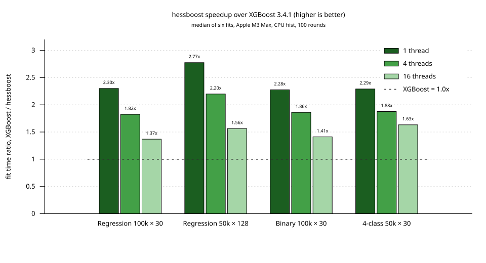
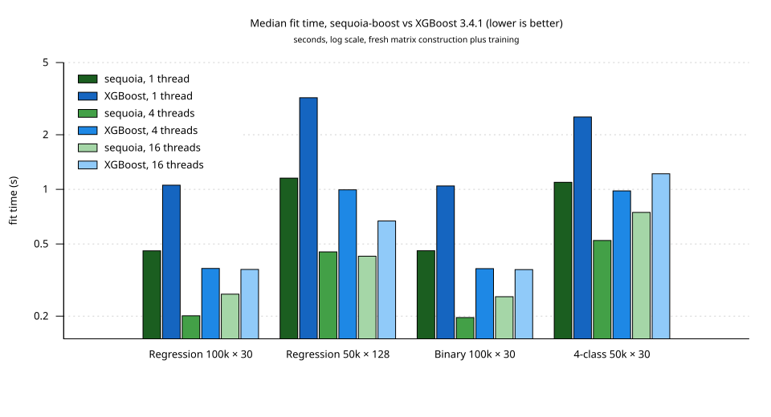
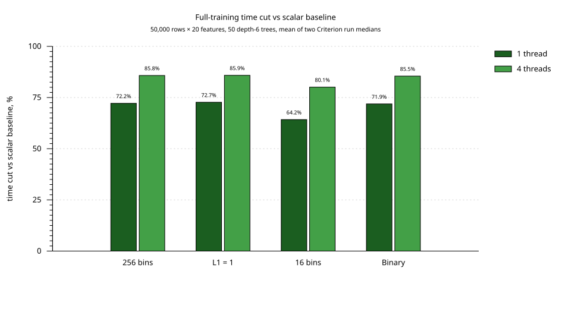
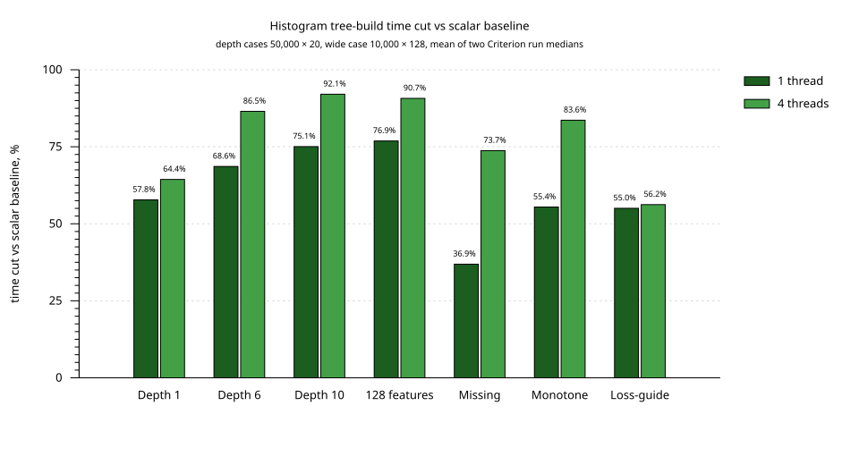
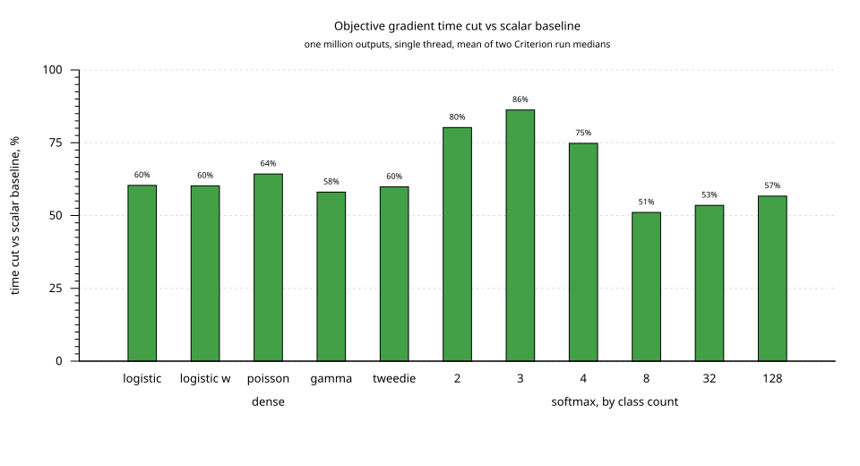
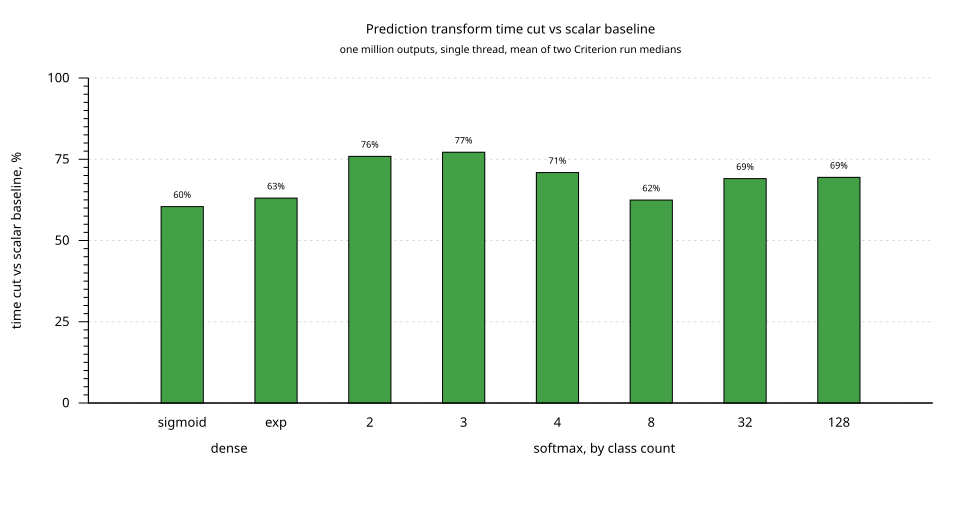
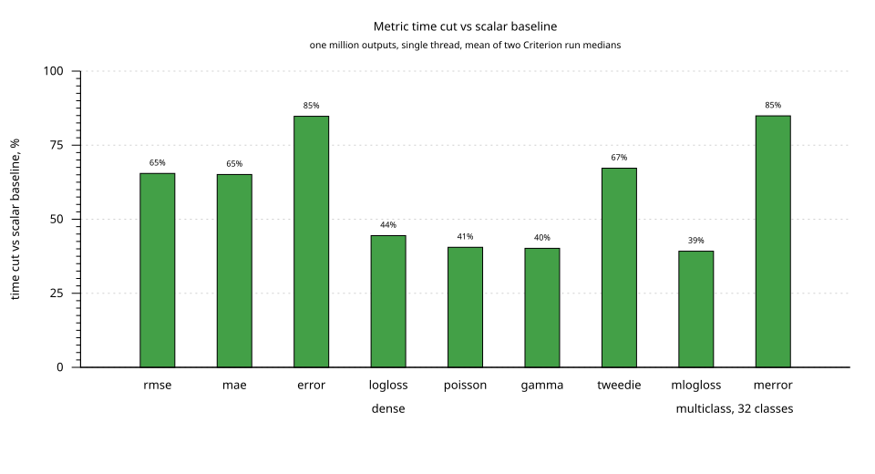

# Performance

sequoia-boost combines runtime-detected SIMD numerical kernels — NEON on
AArch64; AVX2+FMA (split evaluation, exponential and sigmoid transforms,
logistic and short-softmax gradients) and SSE2 (quantile bin search) on
x86-64 — with parallel histogram training. Data preparation and independent
depthwise nodes share the worker pool; histogram task sizes follow node size,
the two children of a large node are evaluated concurrently, and partial
histograms are reduced in parallel by bin range. Training reuses row partitions
where they reduce prediction work, and terminal leaves skip histogram and split
searches. Prediction compares monotone integer keys in a branch-free lockstep
walk. Scalar Rust handles other architectures and inputs outside the vector
paths. Split choices, histogram sums, and prediction results match the scalar
path exactly; the transcendental kernels stay within a few f32 ULPs of the
scalar library functions. This guide compares CPU training with XGBoost and
measures the numerical and tree-building optimizations within sequoia-boost.

## XGBoost comparison

Measured on **Apple M3 Max** against [XGBoost 3.4.1](https://pypi.org/project/xgboost/3.4.1/),
the latest stable PyPI release checked on **2026-09-14 UTC**. Both engines use the
same dense `f32` data and CPU `hist` parameters: 100 boosting rounds, depth 6,
256 bins, `eta=0.1`, and `lambda=1`. Times include fresh training-matrix
preparation and training, and report the median of six fits after warmup.

| Workload | Threads | sequoia-boost | XGBoost 3.4.1 |
|---|---:|---:|---:|
| Regression, 100k × 30 | 1 | 0.458 s | 1.054 s |
| Regression, 100k × 30 | 4 | 0.201 s | 0.366 s |
| Regression, 100k × 30 | 16 | 0.264 s | 0.362 s |
| Regression, 50k × 128 | 1 | 1.153 s | 3.200 s |
| Regression, 50k × 128 | 4 | 0.452 s | 0.994 s |
| Regression, 50k × 128 | 16 | 0.428 s | 0.669 s |
| Binary, 100k × 30 | 1 | 0.459 s | 1.044 s |
| Binary, 100k × 30 | 4 | 0.197 s | 0.366 s |
| Binary, 100k × 30 | 16 | 0.256 s | 0.361 s |
| 4-class, 50k × 30 | 1 | 1.094 s | 2.506 s |
| 4-class, 50k × 30 | 4 | 0.523 s | 0.981 s |
| 4-class, 50k × 30 | 16 | 0.746 s | 1.219 s |

Sequoia has lower median fit time in all 12 configurations in this run.
Single-thread speedups range from 2.28× on binary classification to 2.77× on
wide regression; 30-feature regression reaches 2.30× and multiclass 2.29×. At
four threads, speedups range from 1.82× to 2.20×, and at sixteen threads from
1.37× to 1.63×. Held-out scores are identical to the previous run on every
workload, so the differences reflect training speed, not fit quality. Treat
small differences as near parity given the uncontrolled background activity on
this workstation.





The charts in this guide are rendered by
[`benchmarks/charts.gp`](benchmarks/charts.gp) from the table values recorded
in [`benchmarks/xgboost.dat`](benchmarks/xgboost.dat) and
[`benchmarks/optimization.dat`](benchmarks/optimization.dat). Regenerate
them with `gnuplot -c docs/benchmarks/charts.gp` after updating a data
file. The data files also carry the measurement provenance for each chart.

### CPU scheduling

XGBoost distributes histogram work across nodes and row blocks, and split
searches across nodes and features. Its updater also produces final row
positions. These are useful places to look when a faster numerical kernel has
little effect on total training time. See the upstream
[histogram builder](https://github.com/dmlc/xgboost/blob/v3.4.1/src/tree/hist/histogram.h),
[split evaluator](https://github.com/dmlc/xgboost/blob/v3.4.1/src/tree/hist/evaluate_splits.h),
and [hist updater](https://github.com/dmlc/xgboost/blob/v3.4.1/src/tree/updater_quantile_hist.cc).

Sequoia's scheduler overlaps independent depthwise nodes and limits histogram
allocations by the rows available. Data preparation and margin updates also
share the worker pool. The measured benefit depends on tree shape, feature
count, sampling, and worker count; more workers do not guarantee a faster fit.

### Model quality

Both engines receive the same held-out rows, generated independently of the
training rows from the same distribution. The following scores are from the
single-thread fits; lower is better. These synthetic tasks measure comparable
fit quality under identical hyperparameters, not quality across all datasets.

| Workload | Held-out rows | Metric | sequoia-boost | XGBoost 3.4.1 |
|---|---:|---|---:|---:|
| Regression, 100k × 30 | 20,000 | rmse | 0.060635 | 0.060965 |
| Regression, 50k × 128 | 10,000 | rmse | 0.063959 | 0.064210 |
| Binary, 100k × 30 | 20,000 | logloss | 0.515638 | 0.516273 |
| 4-class, 50k × 30 | 10,000 | mlogloss | 0.150499 | 0.150027 |

### Workloads and method

- Regression predicts `2*x0 - 3*x1² + 0.5*x2 + x3*x4` with Gaussian noise
  of standard deviation 0.05. The 128-feature case adds irrelevant features.
- Binary labels are Bernoulli draws with log-odds
  `4*(x0-0.5) - 3*(x1-0.5) + 2*(x2-0.5)`.
- Four-class labels select the largest of `3*xi - x((i+1) mod 4)` plus Gaussian
  noise of standard deviation 0.1. Each boosting round constructs four trees.

Features are uniform on `[0, 1)`. The NumPy generator and training seed are
1234. Held-out sets have one fifth as many rows as their training sets. Both
engines use depthwise growth, a fixed `base_score=0.5`, `alpha=0`, `gamma=0`,
`min_child_weight=1`, and full row/column sampling. No early stopping or eval
callbacks run inside the timer.

XGBoost uses its macOS ARM64 PyPI wheel with OpenMP enabled and
`QuantileDMatrix`, with quantile construction inside the timer. sequoia-boost
constructs a fresh `DMatrix` inside the timer and bins during training. Both
read identical binary data before timing. Test-matrix preparation, file I/O,
process startup, prediction, scoring, and model destruction are excluded.

The runtime is macOS 26.6.2, Rust 1.98.1 / LLVM 22.1.8, uv-managed Python
3.14.5, NumPy 2.5.2, and XGBoost 3.4.1. Rust uses the release profile
(`opt-level=3`, thin LTO, one codegen unit) without extra `RUSTFLAGS`.
XGBoost's native build reports Clang 15 and OpenMP support. Compilation finishes
before measurements; the two engines run sequentially. This is an interactive
workstation with unrelated CPU activity, so small differences should be treated
as near parity rather than an isolated-machine result.

For each workload and thread count, batches run in
XGBoost/sequoia/sequoia/XGBoost order. Each batch discards one warmup fit and
records three fits. The table uses the median of all six recorded fits per
engine. The [complete results](benchmarks/xgboost.json) include every sample,
minimum/maximum times, held-out scores, native build configuration, dataset and
source hashes, and the executable hash. These numbers describe this CPU and
these synthetic workloads; they do not establish GPU or other-platform
performance.

The result also includes the Cargo lockfile used for these measurements.

Reproduce from the repository root, using a new output directory:

```sh
cargo build --release --example bench_compare
uv run --with xgboost==3.4.1 --with numpy==2.5.2 python scripts/bench_xgb.py \
  --sequoia target/release/examples/bench_compare \
  --output /tmp/sequoia-xgb --threads 1 4 16
```

The [script documentation](../scripts/README.md#xgboost-comparison) describes
workload selection and a quick harness check.

## Optimization benchmarks

These measurements compare the optimized implementation with the scalar
baseline, using the same benchmark source and compiler.

Measured on **Apple M3 Max**, 16 physical cores,
macOS 26.6.2, with **Rust 1.98.1 / LLVM 22.1.8**, on 2026-09-14 UTC.
Both builds use `opt-level=3`, thin LTO, one codegen unit, and no `RUSTFLAGS`.
`RAYON_NUM_THREADS` is fixed per comparison. Compilation and tests finish before
timing begins; the benchmark executables run sequentially. Unrelated workstation
activity remains uncontrolled; alternating run order reduces timing bias but
does not eliminate it.

Each value is the mean of two Criterion run medians, collected in
baseline/optimized/optimized/baseline order. Each run requests 0.5 seconds of
warmup, 1 second of measurement, 20 samples, and 10,000 bootstrap resamples.
Criterion extends measurement time when
needed to collect them. **Less time** is `100 × (1 − optimized / baseline)`.
These are results for the specified machine and workloads, not a guarantee for
every dataset or AArch64 CPU.

### Full training

All cases train 50 depth-six trees on 50,000 rows × 20 features. Data creation
is outside the timer; training includes quantile preparation, gradients,
tree construction, and training-prediction updates.

| Workload | Threads | Baseline (ms) | Optimized (ms) | Less time |
|---|---:|---:|---:|---:|
| Regression, 256 bins | 1 | 398.027 | 110.772 | 72.2% |
| Regression, 256 bins | 4 | 381.738 | 54.300 | 85.8% |
| Regression, L1 = 1 | 1 | 392.963 | 107.278 | 72.7% |
| Regression, L1 = 1 | 4 | 379.340 | 53.641 | 85.9% |
| Regression, 16 bins | 1 | 231.349 | 82.752 | 64.2% |
| Regression, 16 bins | 4 | 220.740 | 43.935 | 80.1% |
| Binary classification | 1 | 408.616 | 114.892 | 71.9% |
| Binary classification | 4 | 396.398 | 57.560 | 85.5% |



### Single histogram tree

Cuts, binned data, and gradients are prepared outside the timer. These cases
isolate tree construction, including the column sampler, histogram building,
row partitioning, and split evaluation.

| Workload | Threads | Baseline (ms) | Optimized (ms) | Less time |
|---|---:|---:|---:|---:|
| Depth 1 | 1 | 0.855 | 0.361 | 57.8% |
| Depth 1 | 4 | 0.618 | 0.220 | 64.3% |
| Depth 6 | 1 | 6.866 | 2.155 | 68.6% |
| Depth 6 | 4 | 6.726 | 0.908 | 86.5% |
| Depth 10 | 1 | 49.609 | 12.373 | 75.1% |
| Depth 10 | 4 | 49.458 | 3.926 | 92.1% |
| 128 features | 1 | 24.854 | 5.742 | 76.9% |
| 128 features | 4 | 24.886 | 2.310 | 90.7% |
| Missing values | 1 | 9.409 | 5.938 | 36.9% |
| Missing values | 4 | 9.287 | 2.438 | 73.7% |
| Monotone constraint | 1 | 9.193 | 4.096 | 55.4% |
| Monotone constraint | 4 | 9.008 | 1.475 | 83.6% |
| Loss-guide growth | 1 | 6.843 | 3.077 | 55.0% |
| Loss-guide growth | 4 | 6.680 | 2.924 | 56.2% |

Depth cases use 50,000 rows × 20 features. The wide case uses 10,000 rows × 128
features at depth six. Missing, monotone, and loss-guide cases use the depth-six
dataset; missing values occupy 2 of every 11 feature entries, the first feature
has an increasing constraint in the monotone case. All cases use 256 bins.
Loss-guide growth uses a 64-leaf limit; depthwise growth stops at its configured
depth.



### Numerical kernels

Pointwise cases process one million predictions. Multiclass cases contain
`floor(1,000,000 / classes)` rows, keeping the output count near one million.
Transforms include copying the input into the reusable output buffer. Metrics
include final normalization. These single-thread measurements use prepared
inputs, not tree training.







| Workload | Threads | Baseline (ms) | Optimized (ms) | Less time |
|---|---:|---:|---:|---:|
| Logistic gradient | 1 | 2.041 | 0.809 | 60.4% |
| Logistic gradient, weighted | 1 | 2.038 | 0.811 | 60.2% |
| Poisson gradient | 1 | 2.608 | 0.932 | 64.2% |
| Gamma gradient | 1 | 1.380 | 0.579 | 58.0% |
| Tweedie gradient | 1 | 2.630 | 1.056 | 59.8% |
| Softmax gradient, 2 classes | 1 | 4.210 | 0.833 | 80.2% |
| Softmax gradient, 3 classes | 1 | 5.890 | 0.810 | 86.2% |
| Softmax gradient, 4 classes | 1 | 3.574 | 0.901 | 74.8% |
| Softmax gradient, 8 classes | 1 | 2.675 | 1.309 | 51.1% |
| Softmax gradient, 32 classes | 1 | 2.176 | 1.012 | 53.5% |
| Softmax gradient, 128 classes | 1 | 2.188 | 0.948 | 56.6% |
| Sigmoid transform | 1 | 1.448 | 0.573 | 60.4% |
| Exponential transform | 1 | 1.280 | 0.473 | 63.1% |
| Softmax transform, 2 classes | 1 | 2.339 | 0.564 | 75.9% |
| Softmax transform, 3 classes | 1 | 2.378 | 0.543 | 77.2% |
| Softmax transform, 4 classes | 1 | 1.997 | 0.581 | 70.9% |
| Softmax transform, 8 classes | 1 | 1.896 | 0.712 | 62.4% |
| Softmax transform, 32 classes | 1 | 1.877 | 0.581 | 69.1% |
| Softmax transform, 128 classes | 1 | 1.927 | 0.589 | 69.4% |
| RMSE, weighted | 1 | 0.776 | 0.268 | 65.4% |
| MAE, weighted | 1 | 0.768 | 0.268 | 65.1% |
| Binary error, weighted | 1 | 1.338 | 0.204 | 84.8% |
| Log loss, weighted | 1 | 4.930 | 2.738 | 44.5% |
| Poisson NLL, weighted | 1 | 2.598 | 1.545 | 40.5% |
| Gamma NLL, weighted | 1 | 2.633 | 1.575 | 40.2% |
| Tweedie NLL, weighted | 1 | 13.797 | 4.521 | 67.2% |
| Multiclass log loss, 32 classes, weighted | 1 | 0.102 | 0.062 | 39.5% |
| Multiclass error, 32 classes, weighted | 1 | 1.616 | 0.244 | 84.9% |

The [complete results](benchmarks/performance.json) include all 73
single-thread cases and 11 four-thread cases, including unweighted metrics,
additional class counts, and histogram-accumulation controls. Histogram
accumulation controls exercise the scalar accumulation loop and task scheduling;
tree construction also measures split evaluation, parallel nodes, and avoiding
unnecessary child work. The
[compressed samples](benchmarks/performance-samples.json.gz) contain Criterion
estimates, confidence intervals, raw samples, logs, the shared benchmark source,
lockfile, and a patch that reconstructs the measured optimized source. The
result file records executable and source SHA-256 hashes.

## Implementation

The private `simd` module owns dispatch and numerical kernels. AArch64 checks
NEON support and x86-64 checks AVX2+FMA support once per process and caches
the result. Other architectures use scalar Rust; no target-specific build
flags are required. Dispatch checks the
slice lengths before entering an unsafe kernel, and vector loads and stores
stay within complete blocks. Scalar formulas are shared by whole-input
fallbacks, exceptional blocks, and tails.

| Operation | NEON path |
|---|---|
| Logistic, Poisson, Gamma, Tweedie gradients | Four `f32` predictions per block, with weighted and unweighted inputs |
| Sigmoid and exponential transforms | Four `f32` predictions per block |
| Softmax gradients and transforms, 2–4 classes | Four rows at a time using interleaved loads and stores |
| Softmax gradients and transforms, 8+ classes | Vector blocks within each row |
| RMSE, MAE, binary error, log loss, count metrics | `f64` reductions with optional weights |
| Multiclass log loss | Gathered label probabilities with `f64` logarithms |
| Multiclass error, 8+ classes | Vector row maxima |
| Histogram statistics and dense numeric split gains | Two `f64` lanes |

Most kernels require at least 16 input elements. Softmax with 5–7 classes uses
the scalar path. The `f32` exponential uses range reduction and a degree-seven
polynomial for finite inputs in `[-80, 80]`; other inputs use `f32::exp`.
Softmax subtracts the row maximum and falls back for nonfinite rows or a margin
spread above 80. The exponential uses Estrin evaluation for gradients and
small-class softmax, and Horner evaluation for wide in-place softmax. Metric
logarithms and Tweedie exponentials use `f64` throughout.

The histogram builder uses NEON to prefilter dense numeric features without
monotone constraints or a nonzero `max_delta_step`. Prefix statistics and
accepted-candidate comparisons remain sequential, preserving split order, ties,
and the gain epsilon. Bins that cannot improve the best gain are rejected in
vector registers without lane extraction; the division-free bound is
saturated before that comparison, and subnormal products or intermediates take
the exact comparison, where the scalar `calc_gain` arithmetic decides
surviving candidates. The x86-64 scan follows the same contract with an
AVX2 prefilter. Missing-value and constrained split searches retain their
scalar evaluation.

Depthwise growth expands nodes and draws child feature samples in traversal
order, then partitions rows, builds histograms, and evaluates the independent
nodes in parallel. Candidate scans within a node retain their original order.
Loss-guide growth retains its priority-queue ordering. Histogram accumulation
limits the task count to one per 4,096 rows, capped at the worker count,
so a smaller node does not allocate a full histogram for every worker.

Leaves at `max_depth` need no histograms or split searches. With full row
sampling and at most four workers, training retains their final row partitions
and adds the finalized leaf values directly to cached training margins. Larger
pools, sampled training, and evaluation datasets update independent rows in
parallel, skipping small inputs where task overhead would dominate. Leaf
statistics, monotone bounds, and column-sampler draws are preserved.

Quantile cuts are sorted independently by feature, and rows are binned in
parallel chunks. Ordered collection preserves the cut layout, row order,
missing-value handling, categorical bins, and the choice of 16- or 32-bit bin
storage. These scheduling changes also work on other CPU architectures.

### Prediction

`BoostedModel` lazily derives a prediction layout of the ensemble on first use
and drops it whenever a tree is appended; it is never serialized. Every tree is
renumbered breadth-first into one 16-byte-node arena so that the two children
of a node are adjacent, and each numeric split is stored as a single ordered
compare that is false for missing values: splits whose missing values go left
store the next-lower threshold, splits whose missing values go right store
mirrored children, a negated threshold, and a sign mask applied to the feature
value. Leaves point at themselves. A traversal step is therefore a node load, a
feature load, an XOR, a compare, and an add, with no data-dependent branch.
Sixteen rows are walked in lockstep for a fixed number of levels (the tree
depth), and batches of fewer than sixteen rows walk sixteen trees in lockstep
instead. Rows are processed in 256-row blocks in parallel; each block stores
its full sixteen-row groups feature-major (`[group][feature][lane]`) so a
lane's value is an immediate offset from the group's feature base and the
kernel needs no per-lane address registers. Within a block the trees are
summed in order, so results match the sequential sum bit for bit. CSR rows and
dense matrices with a non-`NaN` missing sentinel are scattered straight into
that layout per block; matrices wider than 4,096 sparse columns use per-lookup
access. Categorical splits and trees deeper than 16 levels use an early-exit
walk. The kernel runs at roughly six instructions per cycle on a Neoverse V3
and is bound by instruction issue, not memory.

TreeSHAP walks each tree with a preallocated path arena instead of cloning the
decision path at every fork, precomputes each node's cover fraction, reads the
instance as a dense row, hoists the per-element divisions out of the
unwinding loops, folds the recurrence coefficients off the loop-carried
dependency so each unwinding step is one multiply-subtract, and adds one
shared constant for all path elements that lie off the instance's own path
(their cover fraction cancels). Rows are processed in parallel. On a Neoverse
V3 core these changes cut prediction time by 10–20× for dense, sparse, and
multiclass batches and by 8–9× for SHAP contributions relative to the per-node
traversal.

## Numerical behavior and validation

Objective outputs remain `f32`; metrics and histogram statistics accumulate
in `f64`. SIMD reductions and polynomial evaluation can change rounding, so
cross-architecture predictions are not promised to be bit-identical. Repeated
training with the same inputs, parameters, seed, and execution configuration
remains deterministic.

The test suite compares kernels against scalar formulas, including short
inputs, vector tails, optional weights, saturation, NaNs, infinities, and
softmax ties. Gradient checks use `1e-6 * max(1, |reference|)`; metric checks use
relative tolerances between `1e-12` and `3e-12` for their finite test datasets.
Split tests check candidate order and the sequential gain epsilon. These are
test tolerances, not universal error bounds for arbitrary inputs.

Validation for the recorded build includes debug and release tests, Clippy,
XGBoost regression/binary/multiclass quality parity, a Rust 1.86 build, and an
x86_64 cross-check. A separate 108-case equivalence check covers dense, missing,
categorical, sampled, constrained, and multiclass trees. It verifies serialized models and
predictions with one, four, and sixteen threads; its source and result hashes are
included with the benchmark samples.

```sh
cargo test --workspace --locked
cargo test --workspace --locked --release
cargo clippy --locked --all-targets --all-features -- -D warnings
cargo fmt --all --check
cargo test --locked --test parity -- --ignored
cargo +1.86.0 build --locked
cargo check --locked --all-targets --all-features --target x86_64-pc-windows-gnu
```

Generate the parity fixtures first using the
[fixture instructions](../scripts/README.md#parity-fixtures). The cross-check
requires the corresponding Rust target to be installed and checks compilation
only.

## Reproduce the measurements

The benchmark definitions live in
[`benches/training.rs`](../crates/sequoia-boost/benches/training.rs). To run the
suite on the current checkout:

```sh
RAYON_NUM_THREADS=1 cargo bench --locked -p sequoia-boost --bench training
```

To regenerate the charts in this guide from the `.dat` files after updating
the tables, run:

```sh
gnuplot -c docs/benchmarks/charts.gp
```

For an exact source comparison, reconstruct both trees from the recorded
baseline revision and source archive. Run from the repository root:

```sh
export BENCH_WORKDIR="$(mktemp -d)"
uv run python - <<'PY'
import gzip
import io
import json
import os
from pathlib import Path
import subprocess
import tarfile

root = Path(os.environ['BENCH_WORKDIR'])
record = json.loads(gzip.decompress(
    Path('docs/benchmarks/performance-samples.json.gz').read_bytes()))['source']
archive = subprocess.check_output(['git', 'archive', record['baseline_revision']])
for name in ['baseline', 'optimized']:
    tree = root / name
    tree.mkdir()
    with tarfile.open(fileobj=io.BytesIO(archive)) as source:
        source.extractall(tree, filter='data')
    if name == 'optimized':
        subprocess.run(['git', 'apply', '--no-index', '-'], cwd=tree,
                       input=record['optimized_patch'].encode(), check=True)
    (tree / 'Cargo.lock').write_text(record['lockfile'])
    (tree / 'crates/sequoia-boost/benches/training.rs').write_text(
        record['benchmark_source'])
    build = subprocess.check_output([
        'cargo', '+1.98.1', 'bench', '--locked', '--no-run',
        '-p', 'sequoia-boost', '--bench', 'training', '--message-format=json',
    ], cwd=tree, env=dict(os.environ,
                         CARGO_TARGET_DIR=str(root / f'{name}-target')))
    artifacts = [json.loads(line) for line in build.splitlines()]
    executable = next(Path(item['executable']) for item in artifacts
                      if item.get('reason') == 'compiler-artifact'
                      and item['target']['name'] == 'training'
                      and item.get('executable'))
    (root / f'{name}-bench').symlink_to(executable)
PY

uv run python scripts/compare_benchmarks.py \
  --baseline "$BENCH_WORKDIR/baseline-bench" \
  --optimized "$BENCH_WORKDIR/optimized-bench" \
  --output "$BENCH_WORKDIR/results-t1" --threads 1 \
  --warmup 0.5 --measurement 1 --samples 20 --resamples 10000 \
  --filter 'objective_gradient|prediction_transform/.*automatic|prediction_transform_multiclass|pointwise_metric|log_metric|multiclass_metric|hist_tree_build|histogram_build|train_50k_x20_50rounds/Hist|train_binary_50k_x20_50rounds/automatic'

uv run python scripts/compare_benchmarks.py \
  --baseline "$BENCH_WORKDIR/baseline-bench" \
  --optimized "$BENCH_WORKDIR/optimized-bench" \
  --output "$BENCH_WORKDIR/results-t4" --threads 4 \
  --warmup 0.5 --measurement 1 --samples 20 --resamples 10000 \
  --filter 'hist_tree_build|train_50k_x20_50rounds/Hist|train_binary_50k_x20_50rounds/automatic'
```

The reconstruction snippet requires Python 3.12+ and Rust 1.98.1. Keep
`RUSTFLAGS`, `CARGO_ENCODED_RUSTFLAGS`, `CARGO_BUILD_TARGET`, and Cargo profile
overrides unset to match the recorded build. The comparison runner itself uses
only the Python standard library. It creates separate Criterion directories
for each run and refuses to overwrite an existing output directory.

For XGBoost quality fixtures and the separate XGBoost timing harness, see
[Development scripts](../scripts/README.md).
