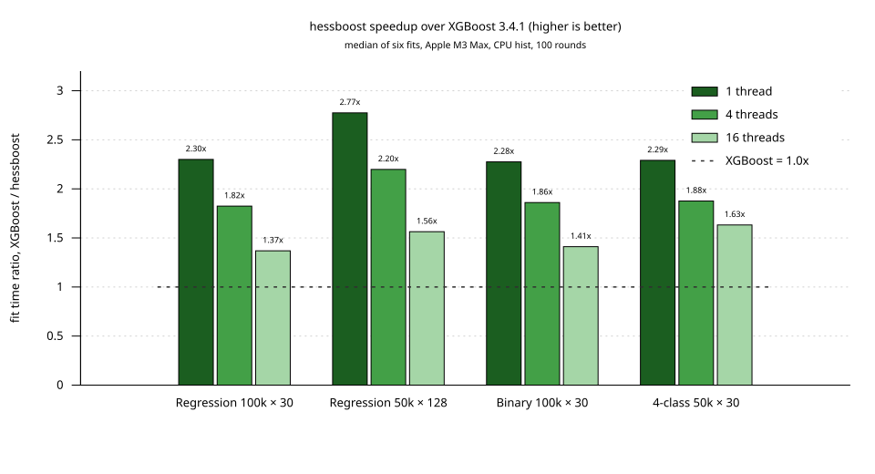
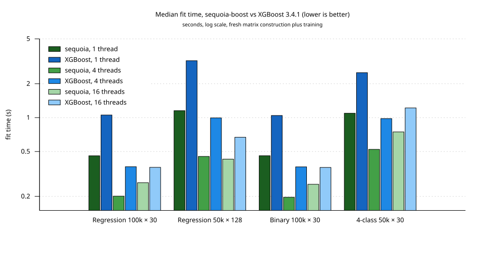

# Performance

hessboost trains on parallel histograms with runtime-detected SIMD kernels:
NEON on AArch64; AVX2+FMA (gradients with their exp/sigmoid/softmax) and SSE2
(bin search) on x86-64. Split search and prediction transforms stay scalar;
prediction walks monotone integer keys branch-free. Everything else is
scalar Rust. Split choices, histogram sums, and predictions match the scalar
path exactly; gradient transcendentals stay within a few f32 ULPs of the
scalar functions.

Below: training against XGBoost, quantized gradients and symmetric trees
against the defaults, the GPU backends against the CPU, and how the CPU path
is built.

## XGBoost comparison

Measured on **Apple M3 Max** against [XGBoost 3.4.1](https://pypi.org/project/xgboost/3.4.1/),
the latest stable PyPI release checked on **2026-09-26 UTC**. Same dense `f32`
data and CPU `hist` settings on both sides: 100 rounds, depth 6, 256 bins,
`eta=0.1`, `lambda=1`. Times cover fresh training-matrix preparation plus
training; each is the median of six fits after warmup.

| Workload | Threads | hessboost | XGBoost 3.4.1 |
|---|---:|---:|---:|
| Regression, 100k × 30 | 1 | 0.412 s | 1.054 s |
| Regression, 100k × 30 | 4 | 0.158 s | 0.367 s |
| Regression, 100k × 30 | 16 | 0.203 s | 0.360 s |
| Regression, 50k × 128 | 1 | 1.057 s | 3.220 s |
| Regression, 50k × 128 | 4 | 0.357 s | 0.986 s |
| Regression, 50k × 128 | 16 | 0.326 s | 0.657 s |
| Binary, 100k × 30 | 1 | 0.402 s | 1.044 s |
| Binary, 100k × 30 | 4 | 0.156 s | 0.363 s |
| Binary, 100k × 30 | 16 | 0.199 s | 0.356 s |
| 4-class, 50k × 30 | 1 | 0.929 s | 2.505 s |
| 4-class, 50k × 30 | 4 | 0.299 s | 0.972 s |
| 4-class, 50k × 30 | 16 | 0.235 s | 1.188 s |

hessboost is faster in all 12 configurations: 2.6–3.0× single-threaded,
2.3–3.3× at four threads, and 1.8–2.0× at sixteen threads (5.0× on
multiclass).





Charts are rendered by [`benchmarks/charts.gp`](benchmarks/charts.gp) from
the table values in [`benchmarks/xgboost.dat`](benchmarks/xgboost.dat);
regenerate with `gnuplot -c docs/benchmarks/charts.gp` after updating it.

### CPU scheduling

Both engines spread histogram work over nodes and row blocks and split
search over nodes and features. hessboost also overlaps independent
depthwise nodes, sizes histogram tasks by node, and shares one worker pool
with data preparation and margin updates. Scaling depends on tree shape,
feature count, sampling, and worker count, so more workers are not always
faster (two of the four workloads above run slower at 16 threads than at 4).

### Model quality

Same held-out rows on both sides, drawn separately from the training rows.
Scores below are the single-thread fits; lower is better. Synthetic tasks
with identical hyperparameters — a comparability check, not a general
quality claim.

| Workload | Held-out rows | Metric | hessboost | XGBoost 3.4.1 |
|---|---:|---|---:|---:|
| Regression, 100k × 30 | 20,000 | rmse | 0.060965 | 0.060965 |
| Regression, 50k × 128 | 10,000 | rmse | 0.064210 | 0.064210 |
| Binary, 100k × 30 | 20,000 | logloss | 0.516273 | 0.516273 |
| 4-class, 50k × 30 | 10,000 | mlogloss | 0.150027 | 0.150027 |

The scores agree within 1e-9 on every workload, so the timing gaps are
speed, not fit quality.

### Workloads and method

- Regression: `2*x0 - 3*x1² + 0.5*x2 + x3*x4` plus N(0, 0.05²). The
  128-feature case adds irrelevant features.
- Binary: Bernoulli draws with log-odds `4*(x0-0.5) - 3*(x1-0.5) + 2*(x2-0.5)`.
- Four-class: argmax of `3*xi - x((i+1) mod 4)` plus N(0, 0.1²); four trees
  per round.

Features uniform on `[0, 1)`; NumPy and training seed 1234. Held-out sets are
one fifth the training rows. Both sides: depthwise growth,
`base_score=0.5`, `alpha=0`, `gamma=0`, `min_child_weight=1`, full
row/column sampling, no early stopping or eval callbacks in the timer.

XGBoost uses its macOS ARM64 PyPI wheel (OpenMP) with `QuantileDMatrix`
built in the timer; hessboost builds a fresh `DMatrix` in the timer and bins
during training. Both read identical binary data beforehand. Excluded from
timing: test-matrix prep, file I/O, startup, prediction, scoring, teardown.

Runtime: macOS 27.0, Rust 1.98.1 / LLVM 22.1.8, uv Python 3.14.5, NumPy
2.5.2, XGBoost 3.4.1. Rust release profile, no extra `RUSTFLAGS`; XGBoost
native build reports Clang 15 + OpenMP. Compiled first, engines run
sequentially. Interactive workstation with unrelated CPU activity — treat
small gaps as near parity.

Batches run XGBoost/hessboost/hessboost/XGBoost per workload and thread
count: one warmup fit discarded, three recorded, per batch; the table takes
the median of all six fits per engine. This CPU and these synthetic
workloads only — no GPU or cross-platform claim. Full per-fit samples,
scores, build info, and source hashes land in the output directory.

Reproduce from the repository root, using a new output directory:

```sh
cargo build --release --example bench_compare
uv run --with xgboost==3.4.1 --with numpy==2.5.2 python scripts/bench_xgb.py \
  --hessboost target/release/examples/bench_compare \
  --output /tmp/hessboost-xgb --threads 1 4 16
```

Workload selection and a quick harness check are in the
[script docs](../scripts/README.md#xgboost-comparison).

## Quantized-gradient training (opt-in)

`use_quantized_grad` (LightGBM-style quantized training, not XGBoost
behavior) packs each bin's two `f64` sums into one integer — 32-bit up to
`32767 / Q` rows, else 64-bit. Oversized nodes accumulate row runs in an
L1-resident 32-bit scratch histogram first. Rows read as one `i32` instead
of an 8-byte gradient pair. Split scoring reads dequantized sums, paying one
extra pass per split to dequantize both child histograms.

**AWS Neoverse-V3** (192 cores, Linux 6.12), **Rust 1.98.1**, `opt-level=3`,
thin LTO, one codegen unit, 2026-09-23 UTC. Criterion medians (2 s warmup,
6 s measurement) on a busy host — treat gaps under ~3% as noise. Q = 4,
stochastic rounding, no leaf renewal. Both columns are the same cases on the
same machine and run.

| Workload | Threads | Full precision (ms) | Quantized (ms) | Speedup |
|---|---:|---:|---:|---:|
| Tree, depth 6, 50k × 20 | 1 | 5.935 | 5.982 | 0.99× |
| Tree, depth 6, 50k × 20 | 16 | 1.387 | 1.314 | 1.06× |
| Tree, depth 10, 50k × 20 | 1 | 64.10 | 65.70 | 0.98× |
| Tree, depth 10, 50k × 20 | 16 | 5.197 | 5.195 | 1.00× |
| Tree, 128 features, 10k rows | 1 | 26.35 | 26.77 | 0.98× |
| Tree, 128 features, 10k rows | 16 | 5.527 | 5.298 | 1.04× |
| Tree, missing values | 1 | 11.50 | 11.32 | 1.02× |
| Tree, missing values | 16 | 2.875 | 2.825 | 1.02× |
| Tree, depth 8, 1M × 50 | 1 | 274.9 | 181.7 | **1.51×** |
| Tree, depth 8, 1M × 50 | 16 | 29.81 | 16.09 | **1.85×** |
| Training, regression, 50 rounds | 1 | 308.8 | 318.5 | 0.97× |
| Training, regression, 50 rounds | 16 | 77.22 | 71.92 | 1.07× |
| Training, binary, 50 rounds | 1 | 309.4 | 323.7 | 0.96× |
| Training, binary, 50 rounds | 16 | 80.24 | 75.01 | 1.07× |

Only worth it when accumulation dominates the build — the 1M-row case, where
it is about half the profile. On 50k rows and 128 features, gain evaluation
(identical code in both modes) dominates: the integer histograms save about
a third of the smaller accumulation share, and the quantization plus
per-split dequantization passes give most of it back. Net: 3–4% slower
single-threaded training on 50k rows, ~7% faster at 16 threads.

## Symmetric trees

Symmetric trees (`grow_policy = symmetric`, or any imported tree of that
shape) predict without a tree walk: each level is one compare, and the
outcome bits index a leaf table ([Prediction](#prediction)).
`cargo bench --bench training -- predict_100k` on 100,000 × 30 with 100
depth-6 trees (`eta = 0.1`, rest default), Criterion medians on 192-core
**Neoverse V3** (Rust 1.98.1, 2026-09-23), `RAYON_NUM_THREADS` fixed:

| Threads | Depthwise model (ms) | Symmetric model (ms) | Speedup |
|---:|---:|---:|---:|
| 1 | 132.13 | 13.37 | 9.9× |
| 16 | 8.63 | 1.03 | 8.4× |
| 192 | 1.66 | 0.70 | 2.4× |

Shared row loading and scheduling dominate at full width.

## GPU backends

`device = metal`, `wgpu`, and `cuda` train the same model as the
single-threaded CPU, and GPU prediction returns the CPU's bits. Each
backend's module docs give its design and determinism contract.

### Metal (macOS)

The `metal` feature adds a native Metal backend (`src/backend/metal.rs`).
**Apple M4 Max** (40-core GPU, 14 CPU cores, 16 threads, macOS 27.0, Rust
1.98.1, 2026-09-28):

| Workload | CPU | Metal | Speedup |
|---|---|---|---|
| predict, 500k rows × 30 features, 200 depth-8 trees | 25.7 ms | 8.0 ms | **3.2×** |
| train, 200k × 30, depth 8, 50 rounds | 177 ms | 285 ms | 0.62× |

Histogram builds, by node size (the `metal_histogram_build` benches, 4 CPU
threads against the 40-core GPU):

| Rows × 30 features | CPU | Metal | Speedup |
|---|---|---|---|
| 4M | 6.62 ms | 5.75 ms | **1.15×** |
| 1M | 1.81 ms | 2.11 ms | 0.86× |
| 100k | 0.30 ms | 0.54 ms | 0.56× |

Prediction is where Metal wins: rows walk an L2-resident compact forest
independently, and each call's row upload amortizes over larger batches and
ensembles, so larger models widen the 3.2×. The walk is bound by the cache
lines a warp's scattered node loads touch, so a model that fits is uploaded
at 8 bytes per node (categorical splits, vector leaves, and multi-output
models keep 16), and a call pipelines its row blocks: one uploads while the
GPU walks another.

Training sums each node's histogram in exact integers, so it reproduces the
CPU's `f64` sums bit for bit. A node's fixed gather-and-merge cost amortizes
over its rows, so the GPU overtakes the CPU between 1M and 4M rows per node:
`device = metal` pays for the large nodes of a big dataset and trails the
CPU below that. Nodes of at least 8,192 rows go to the GPU; smaller nodes,
non-finite gradients, and data outside the exactness bound run on the CPU.
The threshold that minimizes training time depends on the machine and the
workload.

```sh
cargo bench --features metal --bench training -- metal
cargo run --release --features metal --example metal
```

### wgpu (Vulkan, Metal, DirectX 12)

The `wgpu` feature adds a portable backend (`src/backend/wgpu.rs`) with
Metal's histogram design and exactness bound, but without its register-bin
fallback or 8-byte prediction encoding: a node whose grain counts overflow
the integer pieces runs on the CPU, and prediction reads 16 bytes per node.
Software adapters such as Mesa's lavapipe are correct but slower than the
CPU. Run the benches on a machine with an adapter (`WGPU_ADAPTER_NAME` picks
one; the group prints which adapter ran and whether it is a software
renderer):

```sh
cargo bench --features wgpu --bench training -- wgpu
cargo run --release --features wgpu --example wgpu
```

### CUDA (Linux)

The `cuda` feature adds an NVIDIA backend (`src/backend/cuda/mod.rs`). Its
kernels are Rust, the `cuda-kernels/` crate compiled to PTX by
[cuda-oxide](https://nvidia.github.io/cuda-rust/cuda-oxide/) and embedded;
the driver compiles them for the GPU on first use and caches the result.

Rows and histograms stay on the device. Depthwise growth handles a whole
level per round trip: the GPU partitions every splitting node, builds the
smaller child of each split, subtracts its sibling, scans the candidates,
and returns one packed winner per node. Loss-guided growth keeps its heap on
the host and synchronizes twice per expanded node, so small frontiers gain
least. Squared-error and logistic rounds in a plain `gbtree` keep the
margins and gradients resident; other configurations upload gradients once
per tree.

Each node's histogram follows the CPU's summation order: exact integer sums
where the node's sums are exact, exact integer blocks reduced in `f64` in
the CPU's block order, or the CPU's row-order `f64` chains. A non-exact node
the CPU sums as one chain of 8,192 or more rows runs on the CPU, overlapping
the GPU's work on the rest of its level, as do trees with non-finite
gradients and every tree after a CUDA error. Split search reproduces the
CPU's prefix sums (one lane per feature in the CPU's order, or warp scans
where the tree's gradients sum exactly), and a NaN score replays the node on
the host. The kernels are built without contraction, flush-to-zero, or
approximate division, and use no floating-point atomics.

Dense input without missing cells is re-encoded on the device from the CPU's
bins; sparse input, and dense input with missing cells, stays CSR, so device
memory scales with the present entries. Each device keeps up to 64 MiB of
released page-locked memory for the next fit.

`BoostedModel::to_cuda` uploads a compact forest (8 bytes per numeric node,
16 otherwise) and pipelines each call's row blocks through upload, walk, and
readback. Trees add their host-weighted `f32` leaves in tree order, so
margins match the CPU's bits; transforms run on the CPU.

Run the tests and benches on a machine with an NVIDIA GPU, requiring the
device so a missing one cannot pass vacuously:

```sh
HESSBOOST_REQUIRE_CUDA=1 cargo nextest run --release --features cuda --test cuda
HESSBOOST_REQUIRE_CUDA=1 cargo nextest run --release --features cuda --lib backend::cuda tree::builder::hist::device
cargo bench --features cuda --bench training -- cuda
```

The second command runs the `backend::cuda` unit tests (including
`backend::cuda::predict`'s) and `tree::builder::hist::device`'s.

## Implementation

The private `simd` module owns dispatch and kernels. AArch64 checks NEON
once per process, x86-64 checks AVX2+FMA once; the result is cached.
Everything else is scalar Rust, no target flags needed. Dispatch checks
lengths before entering an unsafe kernel; vector traffic stays in complete
blocks. Scalar formulas serve fallbacks, exceptional blocks, and tails.

| Operation | NEON path |
|---|---|
| Logistic, Poisson, Gamma, Tweedie gradients | Four `f32` predictions per block, with weighted and unweighted inputs |
| Softmax gradients, 2–4 classes | Four rows at a time using interleaved loads and stores |
| Softmax gradients, 8+ classes | Vector blocks within each row |
| RMSE, MAE, binary error, log loss, count metrics | `f64` reductions with optional weights |
| Multiclass log loss | Gathered label probabilities with `f64` logarithms |
| Multiclass error, 8+ classes | Vector row maxima |

Minimum 16 elements for most kernels; 5–7-class softmax stays scalar. The
`f32` exp is range reduction plus a degree-seven polynomial (Estrin pairs)
on finite `[-80, 80]`, `f32::exp` elsewhere; softmax subtracts the row max
and bails on nonfinite rows or margin spread above 80. Metric logs and
Tweedie exps stay `f64`.

Depthwise growth expands nodes and draws child feature samples in traversal
order, then partitions, histograms, and evaluates independent nodes in
parallel. Wide nodes also split numeric scans into parallel feature chunks,
merged in feature order under XGBoost's tie rule — the sequential result.
Loss-guide keeps priority-queue order (ids, stats, sampler draws), building
the next-best children ahead of turn in parallel unless per-level/per-node
column sampling is on. One iteration's trees (per class, or a
`num_parallel_tree` forest) grow concurrently after slot-ordered RNG draws.
Exact scans a level's features in parallel the same way, keeping each scan's
node stats in registers and screening candidates with a division-free bound.

Split scoring batches per feature: prefix sums in bin order, then an `f32`
closed form `G · (G / (H + λ))` per child that vectorizes. Only candidates
within `2^-16` relative of the best approximation re-score exactly, in
order; monotone/`alpha`/`max_delta_step`/reuse-penalty/non-finite
configs score everything exactly, still batched. `tree::builder::tests`
checks both against sequential search.

The root sweeps the column-major bin copy two features at a time, one
writer per bin. Other subsets up to 2^18 rows gather per feature pair from
the same copy — no partial histograms, rows ascending per bin. Larger nodes
(8,192+ rows, sparse or big) split into `n / 4,096` fixed blocks, each
summed from zero and added in block order, one wave per worker count — sums
depend on rows, never thread count (serial sums the same blocks). Row
sweeps prefetch four bins before storing. Partitions route rows through a
branch-free loop keyed off the bin, categorical splits included.

Leaves at `max_depth` skip histograms and split search. Under full row
sampling, training keeps their final partitions (depthwise, loss-guide,
exact) and adds leaf values straight into cached margins. Sampled and eval
sets update disjoint rows in parallel, skipping inputs too small to
parallelize. Stats, monotone bounds, and sampler draws preserved.

Cuts sort per feature; rows bin in parallel chunks. Unweighted sketch
queues radix-sort (whole-number weights sum identically in any order).
Large dense inputs validate and copy in parallel. Collection preserves cut
layout, row order, missing handling, categorical bins, and 16/32-bit bin
choice. Half-full-or-denser sparse indexes keep a column-major copy with a
missing sentinel for single-column streaming (categorical splits stream the
same columns through a per-bin left-set table); sparser ones scan stored
bins inline, in parallel row-order chunks for large nodes. Architecture-independent.

Objective gradients and metrics run in parallel over fixed row chunks or
query groups, and AUC, AUCPR, ungrouped ranking metrics, and `cox-nloglik`
sort with a stable parallel sort; each reduces in a fixed order, so values
are bit-identical at any thread count.

A `DMatrix` shares its feature values behind an `Arc`, so a clone (Python's
`set_info`, the per-fold and per-sample matrices) copies only metadata.
Dense input is checked 256 values at a time without a branch, and from 2^22
values on, checked and copied in parallel 2^18-value blocks.

### Prediction

`BoostedModel` derives a prediction layout lazily on first use, drops it
when a tree is appended, never serializes it. Each tree is renumbered
breadth-first into a 16-byte-node arena with adjacent children; each
numeric split becomes one ordered compare that is false for missing (left-
missing stores the next-lower threshold; right-missing mirrors children and
stores a negated threshold plus sign mask; leaves self-loop). One step: node
load, feature load, XOR, compare, add — no data-dependent branch: each lane
steps with `cmp` + `cinc` (`simd::step_if_greater`), since LLVM compiles a
plain select to a branch that random rows mispredict. Sixteen rows walk in
lockstep for the tree depth; batches under sixteen rows walk sixteen trees
in lockstep instead. So does one row (`predict_row`, `predict_row_into`),
keyed once on the stack up to 128 features and per step beyond, so it never
allocates; borrowed rows (`predict_rows`) fill the same blocks a dense
matrix does, without building a matrix. 256-row blocks run in parallel,
each block's sixteen-row groups stored feature-major
(`[group][feature][lane]`); trees sum in order, bit-identical to
sequential. Non-`NaN` sentinels scatter straight in; >4,096 sparse columns
use per-lookup access. Categorical splits and depth-16+ trees take an
early-exit walk.

Symmetric trees skip the walk for full sixteen-row groups. Each level stores
one `(slot, key)` compare plus a `2^depth` leaf table indexed by the
level-outcome bit pattern (root most significant); collapsed subtrees fill
their slots. One vectorizable 16-lane compare per level, no dependent load
chain. Same compares and leaves as the generic walk, so margins and leaf ids
are bit-identical (unit-tested); tails, tiny batches, depth < 2 or > 16,
and oversized tables keep the generic walk.

SHAP is XGBoost 3.4's QuadratureTreeSHAP: one recursive walk per tree with
an 8-lane `f32` quadrature basis, each return edge's contribution read off
its subtree's return. Contributions `O(L · D)` per tree and row, interactions
`O(L · D²)` (`L` leaves, `D` depth), against path-dependent TreeSHAP's
`O(L · D²)` for contributions and a conditioned walk per feature for
interactions. Precomputed nodes hold both branch weights; only the tree's own
split features are cleared and accumulated. Eight rows walk each tree in
lockstep with NEON edge terms and child bases, and rows run in parallel.

## Numerical behavior and validation

Objectives output `f32`; metrics and histogram stats accumulate `f64`. SIMD
rounding means cross-architecture results aren't bit-identical. Same
inputs, params, seed, and execution config still trains deterministically.

Prediction transforms have no vector kernels: each value (each row for
softmax) goes through XGBoost's scalar `expf`, sigmoid, and softmax, so a
prediction never depends on the rows predicted with it, and `predict` is bit
for bit the transform of `predict_margin`.

SHAP mirrors XGBoost 3.4.2's arithmetic: quadrature rule built in `f64`,
stored `f32`; recurrence and accumulations `f32` in XGBoost's order
(categorical children in XGBoost's orientation); per-tree expected value
summed in `f64`, rounded once. aarch64 XGBoost fuses `a * b + c`, x86_64
wheels don't; hessboost matches per target, so imported models reproduce
XGBoost's contributions and interactions bit for bit on the parity fixtures
(aarch64 Linux). Unfused stays within 2e-5 of fused there. The 8-point rule
is exact up to seven distinct path features; longer paths are XGBoost's own
quadrature approximation.

Kernels are tested against scalar formulas (short inputs, tails, weights,
saturation, NaN/inf, softmax ties). Gradient tolerance `1e-6 * max(1,
|reference|)`; metrics `1e-12`–`3e-12` relative on finite fixtures; split
tests check order and the sequential gain epsilon. Test tolerances, not
general error bounds.

## Reproduce the measurements

Benchmarks live in [`benches/training.rs`](../benches/training.rs). Run the
suite on the current checkout with:

```sh
RAYON_NUM_THREADS=1 cargo bench --bench training
```

The quantized-gradient rows use the `*_quantized` cases of `hist_tree_build`
and the `Hist_quantized` / `quantized` training cases; the symmetric-tree
rows are `predict_100k`. The XGBoost comparison and the GPU backends have
their commands in their sections; [Development scripts](../scripts/README.md)
covers the timing harnesses.
